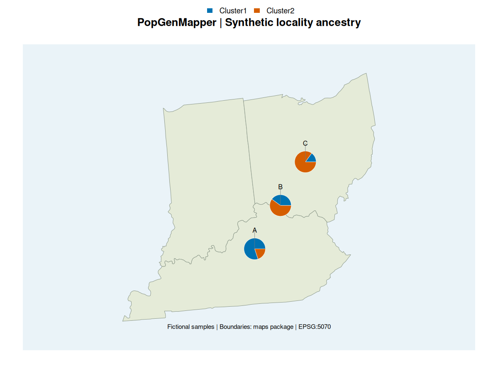
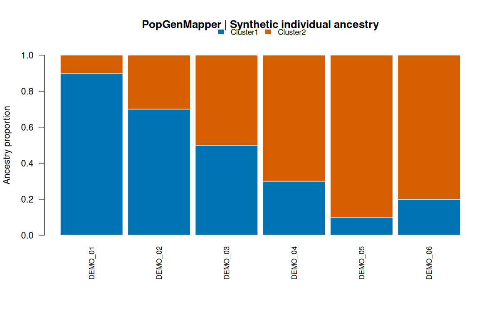

# PopGenMapper

**Validate samples. Compare ancestry. Map geographic patterns.**

An R package in development by **Pauline Owusu-Ansah**, Ph.D. Candidate in Biology at Miami University.

PopGenMapper is being developed to connect ancestry estimates with sample geography through clear validation and consistent visualizations. This development version provides input checks, individual ancestry barplots, regional geographic pie maps, and a fictional example dataset.

## Example gallery

These figures are generated by PopGenMapper from fictional data.



*Three fictional localities; real state boundaries from the maps package. EPSG:5070 projection. The blue background is decorative.*



*The same named cluster palette is used for individuals and locality means.*

[Reproduce these figures](docs/TUTORIAL.md) · [Rendering script](inst/examples/render_demo.R)

## Current status

| Capability | Status |
| --- | --- |
| Check sample IDs and align coordinates | Implemented |
| Validate ancestry proportions and coordinate bounds | Implemented |
| Built-in fictional example data | Included |
| Ancestry barplots | Implemented |
| Regional pie maps and consistent palettes | Implemented |
| Projected sf basemaps and state/country boundary helpers | Implemented |
| Explicit locality summaries and SVG/PDF export | Implemented |
| Automatic label placement with leader lines | Implemented |

**Development version: 0.0.0.9003.** This is an early development package, not a CRAN release. Check [GitHub Actions](https://github.com/codewithPauline/PopGenMapper/actions) for the current package-check result. The initial package check passed on GitHub Actions; each new commit triggers another check.

## Try the development version

Requires R 4.1 or newer. From R:

```r
install.packages("remotes") # once, if needed
remotes::install_github("codewithPauline/PopGenMapper")

library(PopGenMapper)
demo <- example_ancestry()
checked <- validate_ancestry(demo$ancestry, demo$coordinates)
checked$coordinates

palette <- c(Cluster1 = "#0072B2", Cluster2 = "#D55E00")
plot_ancestry_bar(checked, palette = palette)
plot_ancestry_map(checked, palette = palette)
```

The example has six fictional samples and two ancestry clusters. Its coordinates are invented and do not disclose research localities.

## Input format

Provide two data frames with one row per individual:

| Table | Required columns |
| --- | --- |
| Ancestry | `sample_id`, `Cluster1`, `Cluster2`, … |
| Coordinates | `sample_id`, `longitude`, `latitude` |

Sample IDs must be unique character strings and match exactly between tables. Coordinate rows may be in any order: they are aligned to the ancestry rows by ID.

Proportions must be numeric, finite, between zero and one, and sum to one per sample within the selected tolerance. Coordinates must be decimal degrees with longitude in [-180, 180] and latitude in [-90, 90]. Coordinate reference systems are not inferred or transformed.

Custom column names are supported:

```r
checked <- validate_ancestry(
  ancestry = my_ancestry,
  coordinates = my_coordinates,
  id = "Site",
  clusters = c("Cluster1", "Cluster2", "Cluster3"),
  lon = "Lon",
  lat = "Lat"
)
```

`my_ancestry` and `my_coordinates` above are your own data frames, not bundled objects. See `?validate_ancestry` for the function reference.

## Design commitments

- Match samples by explicit IDs, not assumed row order.
- Fail clearly on invalid inputs; never silently drop samples or normalize proportions.
- Keep examples independent of unpublished research data.
- Distinguish ancestry visualization from ancestry inference and species delimitation.

The package displays user-supplied estimates; it does not estimate ancestry or infer migration.

## Development

Clone this repository and run:

```bash
R CMD build .
R CMD check --no-manual PopGenMapper_0.0.0.9003.tar.gz
```

Tests cover shuffled coordinate rows, mismatched and duplicate IDs, invalid proportions, invalid coordinates, and custom cluster columns. They use base R without a testing framework dependency.

## Geographic maps and figure export

The default map draws pies on a labeled coordinate grid. Supply geographic boundaries with a callback, for example if you have the optional `maps` package installed:

```r
plot_ancestry_map(
  checked, palette = palette,
  draw_basemap = function() maps::map("state", add = TRUE, col = "grey60")
)
```

The callback must preserve the existing plot limits and aspect ratio. This first version uses a regional longitude/latitude display, not a projected GIS map. It rejects spans over 60 degrees, polar data, and dateline crossings. Individuals at identical coordinates trigger an overlap warning. Use explicit locality aggregation to draw one pie per sampling locality.

Use R graphics devices to export figures:

```r
pdf("ancestry-map.pdf", width = 9, height = 7)
plot_ancestry_map(checked, palette = palette)
dev.off()
```

A complete SVG demo script is included at [inst/examples/render_demo.R](inst/examples/render_demo.R). The automated workflow exports both example figures as a downloadable artifact.

## One pie per locality

Assign localities explicitly; the package never guesses them from sample names:

```r
demo <- example_ancestry()
demo$coordinates$longitude <- rep(c(-85, -84, -83), each = 2)
demo$coordinates$latitude <- rep(c(38, 39, 40), each = 2)
checked <- validate_ancestry(demo$ancestry, demo$coordinates)
membership <- data.frame(
  sample_id = demo$ancestry$sample_id,
  locality_id = rep(c("A", "B", "C"), each = 2)
)
sites <- aggregate_localities(checked, membership)
sites$sample_counts
plot_ancestry_map(sites, palette = palette)
```

Each locality receives the mean ancestry of its individuals, weighted equally.
If individuals in a locality have different coordinates, supply a
`site_coordinates` table with your chosen locality coordinates. Coordinates
are not averaged automatically.

Map labels now use deterministic candidate placement with leader lines.
Dense maps can still require a larger output device, smaller `label_cex`,
or `labels = FALSE`. Use `label_method = "above"` for the previous placement.

## Projected basemaps

Install the optional geographic dependencies once:

```r
install.packages(c("sf", "maps"))
states <- ancestry_basemap("state", c("ohio", "indiana", "kentucky"))
plot_ancestry_projected(sites, states, crs = 5070, palette = palette)
```

Here `sites` is the locality object from the example above. EPSG:5070 is used
for this contiguous-U.S. example; choose a projection appropriate to your own
region. Both samples and boundaries are transformed using sf. You can also
supply your own sf polygon layer with its CRS declared. Use
`ancestry_basemap("world", regions = "ghana")` to retrieve a country boundary;
a suitable local projection must be supplied when plotting.

The full extent of your supplied basemap is shown. State/country boundaries
come from the maps package; they are display data, not survey-grade boundaries.
The pale blue background is a design choice, not a water-body dataset.

See the [complete mapping tutorial](docs/TUTORIAL.md).

## Platform validation

The development package passed build, `R CMD check --no-manual`, tests,
and installation checks on GitHub-hosted **Windows, macOS, and Linux**
runners using the current R release. All three reported **Status: OK**.

[View the verified run](https://github.com/codewithPauline/PopGenMapper/actions/runs/33997674184)

These checks cover the hosted environments above, not every operating-system
or older R version. Both optional geographic dependencies, sf and maps, were
installed during testing.

## Next milestone

Broader real-world testing and preparation of the first tagged release. See the [roadmap](docs/ROADMAP.md).

## Author and license

**Pauline Owusu-Ansah** · Computational and evolutionary biology  
[GitHub](https://github.com/codewithPauline) · [LinkedIn](https://www.linkedin.com/in/pauline-owusu-ansah-010250192/)

MIT license. Contributions and reproducible bug reports are welcome through [GitHub Issues](https://github.com/codewithPauline/PopGenMapper/issues).
